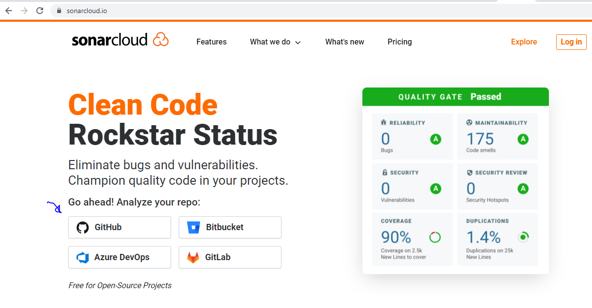
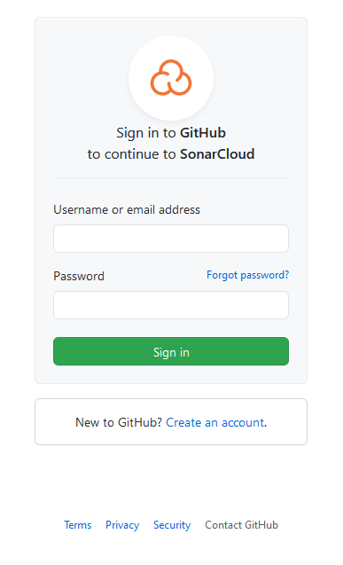
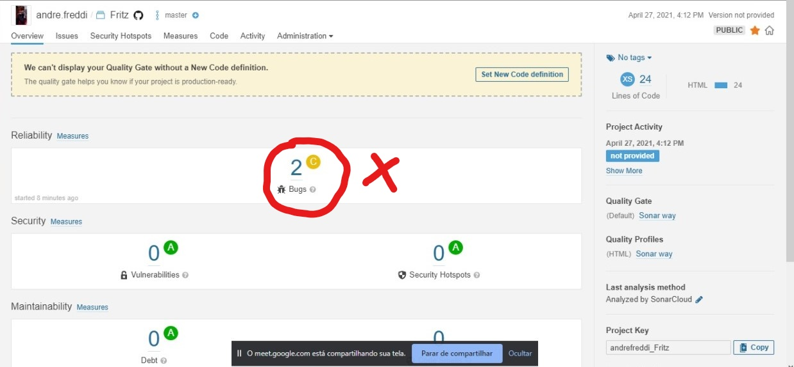
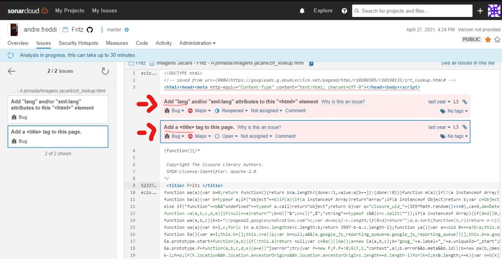
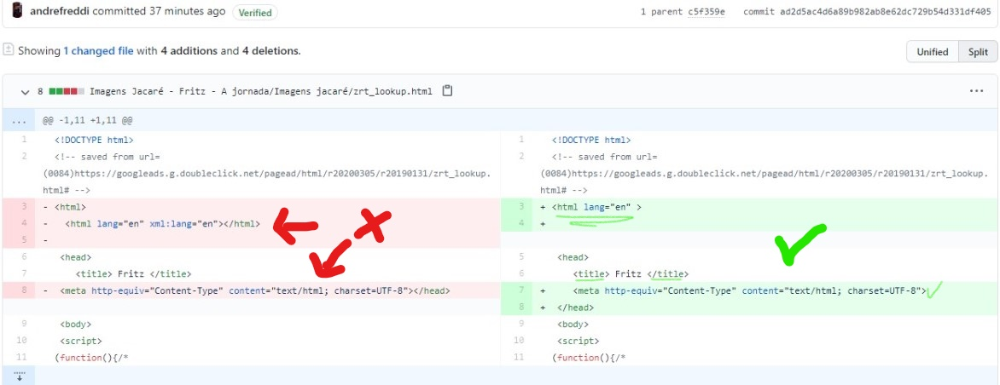
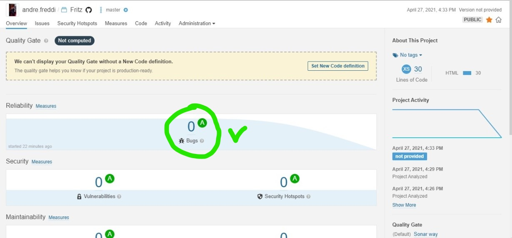

# Conhecimentos iniciais Sonar Cloud!

## como utilizar o Sonar Cloud. 

1- acesse o site do Sonar Cloud clicando em: [sonarcloud.io](https://sonarcloud.io/).

Obs: Sonar Cloud é uma ferramenta de análise de código a fim de analizar débitos técnicos em projetos de software. 

2- Neste exemplo será feita análise em um código no github, para isso clique em github.  

3 - informe login e senha do seu github
 

# Na pratica
#### Para realizar os testes da ferramenta foi utilizado um pequeno repositório de nome "Fritz".

 

- Após adicionar o projeto ao SonarCloud, notamos ter 2 Bugs no projeto...
 

- Após isso, podemos verificar onde e por que ocorre os Bugs, sendo visível o arquivo onde o Bug se encontra e uma possível solução.

 

- Após alterar o código fonte a fim de resolver os bugs e realizar o commit podemos notar na imagem a seguir que os bugs foram resolvidos !

 

- E nosso pequeno projeto esta livre de Bugs !

 
