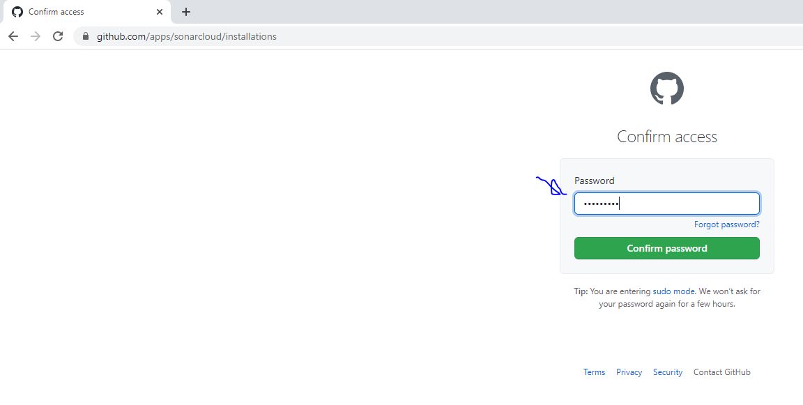

# Conhecimentos iniciais Sonar Cloud!

## como utilizar o Sonar Cloud. 

1- Acesse o site do Sonar Cloud clicando em: [sonarcloud.io](https://sonarcloud.io/).

Obs: Sonar Cloud é uma ferramenta de análise de código a fim de analizar débitos técnicos em projetos de software. 

2- Neste exemplo será feita análise em um projeto no github, para isso clique em github. 

3 - informe login e senha do seu github
 

4 - Importe o seu projeto clicando no botão selecionado.

obs: neste exemplo será feito análise de débitos tecnicos em apenas um repositório.

 5 - marque o a opção Only select repositories e selecione o projeto que deseja fazer a análise e selecione o projeto na lista, neste exemplo será analisado o projeto ponto_org.

6 - Clique em install conforme a figura abaixo.

7 - informe a sua senha do github (Password).

8 - Crie a organização, neste exemplo deixei como sugere o próprio sistema, apenas clicando em continue.

9 - informe o plano, neste exemplo escolhi grátis, ( free plan).

10 - Marque o checkbox do projeto.
 
.

 
 Agora processando o código para análises.
 
 

# Na pratica

#### Para realizar os testes da ferramenta foi utilizado um pequeno repositório de nome "Fritz".

 

- Após adicionar o projeto ao SonarCloud, notamos ter 2 Bugs no projeto...
 

- Após isso, podemos verificar onde e por que ocorre os Bugs, sendo visível o arquivo onde o Bug se encontra e uma possível solução.

 

- Após alterar o código fonte a fim de resolver os bugs e realizar o commit podemos notar na imagem a seguir que os bugs foram resolvidos !

 

- E nosso pequeno projeto esta livre de Bugs !

=======
 

